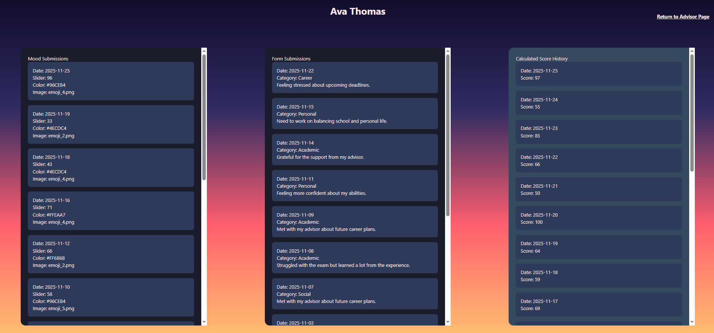

# Aeglero EMR - Mental Health Electronic Medical Records Platform

A HIPAA-compliant mental health EMR application designed to support clinical workflows for mental health advisors and their patients. Built with React and Flask.

---

## Overview

Aeglero EMR is a full-stack healthcare application that enables mental health professionals to track patient wellness, monitor mood trends, and manage clinical documentation. The system emphasizes data security, regulatory compliance, and intuitive clinical workflows.

---

## Features

### For Advisors (Clinicians)
- **Patient Dashboard** — View all assigned patients with priority scoring
- **Mood Trend Analysis** — Track patient wellness over time with visual graphs
- **Search & Filter** — Find patients by name, date, or score value
- **Patient Detail View** — Access complete mood history, journal entries, and calculated scores

### For Patients (Students)
- **Daily Mood Tracking** — Submit mood scores with visual indicators (color, emoji)
- **Journal Entries** — Record thoughts categorized by type (Personal, Academic, Career, Social)
- **Secure Login** — Role-based authentication with daily submission validation

### Security & Compliance
- **Role-Based Access Control** — Separate advisor and patient portals
- **HIPAA-Aligned Design** — PHI handling, data security, confidentiality standards
- **Audit Logging** — Track data modifications with timestamps
- **Data Integrity** — Unique constraints prevent duplicate daily entries

---

## Screenshots

### Advisor Dashboard

*Clinician view showing high-priority patients, search functions, and mood trend graphs*

### Patient Detail View

*Complete patient record with mood submissions, journal entries, and calculated score history*

---

## System Architecture

```


│  React Frontend │────▶│  Flask Backend  │────▶│  PostgreSQL DB  │
│  (Vite + Nginx) │     │  (REST API)     │     │  (Railway)      │


```

### Tech Stack
- **Frontend:** React 18, Vite, TailwindCSS
- **Backend:** Python, Flask, SQLAlchemy
- **Database:** PostgreSQL
- **Deployment:** Docker, Railway
- **Authentication:** Role-based (Advisor/Patient)

---

## Data Model

```
Advisors (1) ──────< Students (N)
                         │
                         ├──< MoodSubmissions (daily mood tracking)
                         │
                         ├──< FormSubmissions (journal entries)
                         │
                         └──< Scores (calculated daily scores)
```

### Key Entities

| Entity | Description |
|--------|-------------|
| **Advisor** | Mental health professional managing multiple patients |
| **Student** | Patient assigned to an advisor |
| **MoodSubmission** | Daily mood entry (slider value, color, emoji) |
| **FormSubmission** | Journal entry with category and text |
| **Score** | Calculated daily wellness score |

---

## Security Features

| Feature | Implementation |
|---------|----------------|
| Role-Based Access | Advisors and patients have separate authentication paths |
| Daily Validation | Patients can only submit one mood entry per day |
| Data Isolation | Advisors only see their assigned patients |
| Audit Timestamps | All records include `created_at` timestamps |
| Secure API | CORS configured, credentials supported |
| Password Hashing | Passwords stored using Werkzeug's secure hashing (PBKDF2-SHA256) |

---

## Getting Started

### Prerequisites
- [Docker Desktop](https://www.docker.com/products/docker-desktop/)

### Quick Start

1. **Clone the repository**
   ```bash
   git clone https://github.com/yourusername/Aeglero_EMR.git
   cd Aeglero_EMR
   ```

2. **Set up environment variables**
   ```bash
   cp .env.example .env
   # Edit .env with your database credentials
   ```

3. **Run with Docker**
   ```bash
   docker compose up --build
   ```

4. **Access the application**
   - Frontend: [http://localhost:3000](http://localhost:3000)
   - Backend API: [http://localhost:5003](http://localhost:5003)

### Development Mode (with hot reload)

```bash
#start backend
docker compose up -d

#start frontend with live reload
cd frontend
npm install
npm run dev
```

---

## Project Structure

```
Aeglero_EMR/
├── backend/
│   ├── app.py              # Flask application entry point
│   ├── models.py           # SQLAlchemy data models
│   ├── auth.py             # Authentication routes
│   ├── advisor_routes.py   # Advisor API endpoints
│   ├── form_routes.py      # Form submission endpoints
│   ├── mood_routes.py      # Mood tracking endpoints
│   └── services/           # Business logic layer
│
├── frontend/
│   ├── src/
│   │   ├── components/     # Reusable UI components
│   │   ├── pages/          # Page-level components
│   │   └── styles/         # CSS stylesheets
│   └── public/
│
├── docs/
│   ├── screenshots/        # Application screenshots
│   ├── REQUIREMENTS.md     # User requirements documentation
│   └── SYSTEM_DESIGN.md    # Technical specifications
│
└── docker-compose.yml
```

---

## API Endpoints

### Authentication
| Method | Endpoint | Description |
|--------|----------|-------------|
| POST | `/auth/login` | User login (advisor or patient) |
| POST | `/auth/create-student` | Register new patient |
| POST | `/auth/create-advisor` | Register new advisor |

### Patient Data
| Method | Endpoint | Description |
|--------|----------|-------------|
| POST | `/mood/submit` | Submit daily mood entry |
| POST | `/form/submit` | Submit journal entry |
| GET | `/advisor/students` | Get all assigned patients |
| GET | `/advisor/student/<id>` | Get patient detail with history |

---

## Testing

```bash
#Run backend tests
docker exec -it cpp-backend python -m pytest

#Run performance tests
cd backend/scripts/baseline
python test_performance.py
```


## Author

**Adrian Caballero**
- Portfolio: [aeglero.com](https://aeglero.com)
- LinkedIn: [linkedin.com/in/adriancaballero](https://linkedin.com/in/abcaballero)
- GitHub: [github.com/adriancaballero](https://github.com/adrianbcaballero)

---

## License

This project is for educational and portfolio purposes. All patient data shown in screenshots is simulated test data.

---

## HIPAA Compliance Note

This application was designed with HIPAA compliance principles in mind, including:
- Role-based access control
- Audit logging capabilities
- Data integrity constraints
- Secure authentication
- PHI handling best practices

For production healthcare use, additional security measures and formal HIPAA compliance certification would be required.
